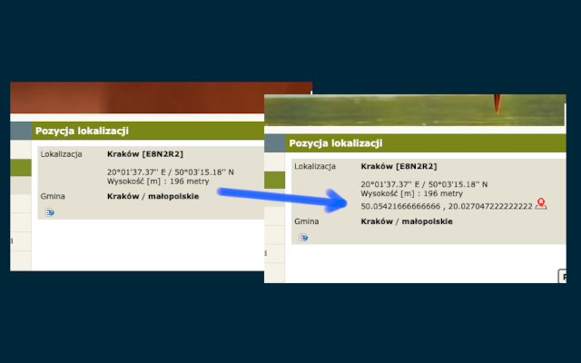

# Ornitho Decorator extension

## Overview
Generates and displays location's coordinates in DD (Decimal Degrees) format.

For example, **20°01'37.37'' E / 50°03'15.18'' N** coordinates are __"translated"__ to **50.05421666666666 , 20.027047222222222**.

It also generates link to Google Maps with the location.

## Example

This is the example of the extension's work:

## Contact

If you have any question or suggestion, drop me an email to [chrome@labaj.com.pl](mailto:chrome@labaj.com.pl).