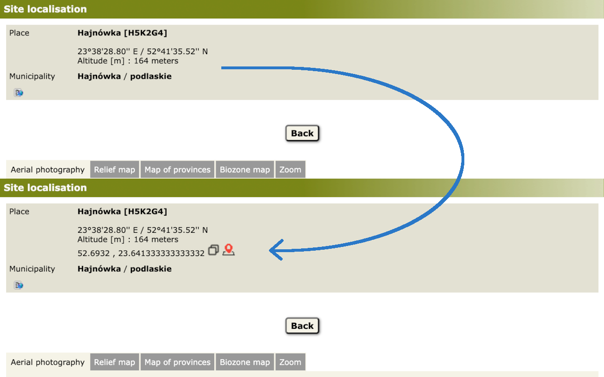

# Ornitho Decorator extension

## Overview
Generates and displays location's coordinates in DD (Decimal Degrees) format.

For example, **20°01'37.37'' E / 50°03'15.18'' N** coordinates are _"translated"_ to **50.05421666666666 , 20.027047222222222**.

It also generates two links. First link copies generated coordinates into the system Clipboard. The second opens Google Maps with the location.

## Usage

### Basic features

The extension is ready to use after the installation. When you open An Ornitho location page you see added line with coordinates and links:

### Configuration

In the extension's Options you can configure where to Google Maps with a location. In the same or the new tab.

## Contact

If you have any question or suggestion, drop me an email to [chrome@labaj.com.pl](mailto:chrome@labaj.com.pl).